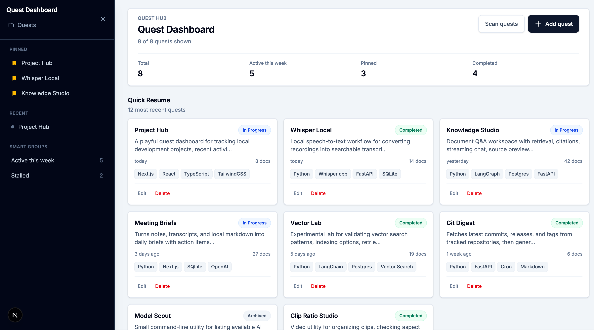
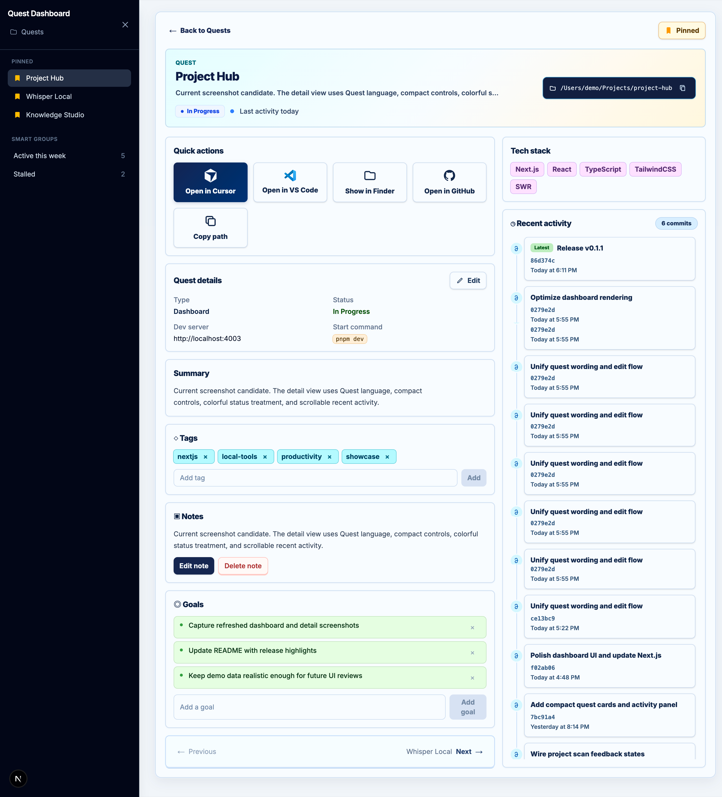
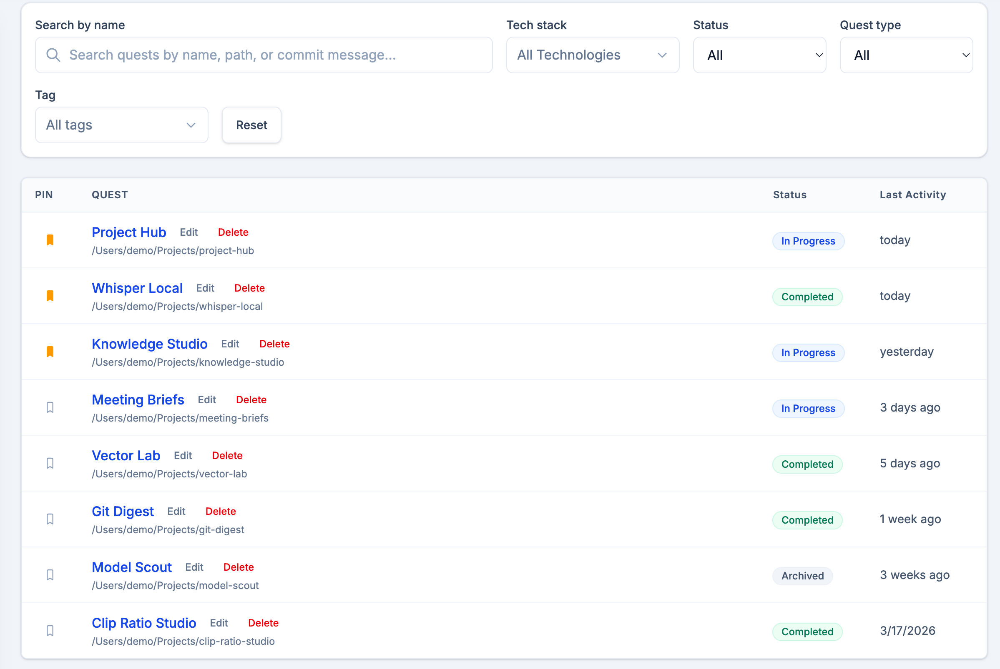
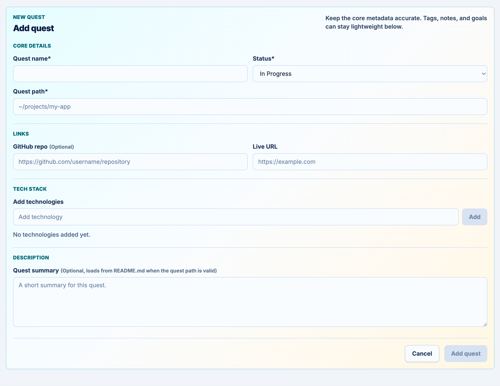

# Project Hub


Project Hub is a local Quest dashboard for tracking development projects across your machine. It keeps lightweight project metadata, quick launch actions, notes, goals, tags, tech stacks, and recent git activity in one focused Next.js app.

[Screenshots](#screenshots) • [Features](#features) • [Getting started](#getting-started) • [Docker](#docker) • [Data](#data) • [Troubleshooting](#troubleshooting)

> [!NOTE]
> Project Hub is designed for local project tracking. Project data lives in `app/data/projects.json`, which is intentionally ignored by git so your local paths and notes do not get committed.

## Screenshots

### Quest Dashboard



### Quest Detail



### Quest List



### Add Quest



## Features

- **Quest dashboard**: Browse recent projects, pinned projects, completion status, active-this-week counts, and stalled work.
- **Project detail pages**: See core metadata, tech stack, summary, tags, notes, goals, quick actions, and recent activity.
- **Fast filtering**: Search by name/path, filter by tech stack, status, quest type, and tags.
- **Quick launch actions**: Open a project in Cursor, VS Code, Finder, GitHub, or copy its path.
- **Local-first storage**: Store project records in a simple JSON file with no external service required.
- **Project scanning**: Discover projects from a configured root path and pull README previews where available.
- **Git activity**: Show recent commits from real git repositories, with optional seeded demo activity for screenshots.
- **Docker support**: Run the app in a container with host project path mapping.

## Tech Stack

- [Next.js](https://nextjs.org/) 16 with the App Router
- [React](https://react.dev/) 19
- [TypeScript](https://www.typescriptlang.org/)
- [Tailwind CSS](https://tailwindcss.com/) 4
- [SWR](https://swr.vercel.app/) for client-side data fetching
- [Biome](https://biomejs.dev/) for formatting and checks
- [Preline UI](https://preline.co/) for overlay behavior

## Getting Started

### Prerequisites

- Node.js 22 recommended
- pnpm 10.28.2, via Corepack or a global install

```bash
corepack enable
corepack prepare pnpm@10.28.2 --activate
```

### Run Locally

```bash
pnpm install
pnpm dev
```

Open [http://localhost:3080](http://localhost:3080).

### Production Mode

```bash
pnpm build
pnpm start
```

Open [http://localhost:3080](http://localhost:3080).

## Docker

Copy the example environment file and set the parent folder that contains your projects:

```bash
cp .env.example .env
```

Example:

```env
HOST_PROJECTS_PATH=/path/to/your/projects
PROJECT_DATA_PATH=./app/data
DEPENDENCY_REPORT_RUN_ENABLED=true
DEPENDENCY_REPORT_COMMAND=python3 /app/tools/dependency-reporter/dependency_reporter.py --config "<generated from projects.json>"
```

Start the container:

```bash
docker compose up -d
```

Open [http://localhost:3080](http://localhost:3080).

> [!IMPORTANT]
> Docker cannot open macOS Finder directly. In Docker, use **Copy path** or configure path mapping with `HOST_PROJECTS_PATH` and `CONTAINER_PROJECTS_ROOT`.

### Dependency Reports in Docker

The dependency updates UI is report-only. In Docker, the **Run report** button generates a temporary reporter config from `projects.json`, runs the bundled reporter script, and writes JSON to `/app-data/dependency-reports`. It does not run package upgrades.

Python projects use a Docker-safe fallback when a macOS `.venv` cannot run in the Linux container:

- If a local venv is runnable, the reporter uses `pip list --outdated` or `uv pip list`.
- If the venv is not runnable, the reporter reads `uv.lock` and compares locked direct dependencies against PyPI.
- If no usable venv or lockfile is available, the report shows a warning for that project.

Inside Docker:

- The dependency reporter is bundled with the app at `/app/tools/dependency-reporter`
- Report JSON is written to `/app-data/dependency-reports`
- `PROJECT_DATA_PATH` is mounted at `/app-data`

You can still generate a report from the host Mac if needed:

```bash
pnpm --dir /path/to/project-tracker-app report:dependencies
```

## Data

Project records are stored in:

```text
app/data/projects.json
```

In Docker, `PROJECT_DATA_PATH` is mounted into the container at `/app-data`, and the app writes `projects.json` there. Keep this mounted to avoid resetting project records when the container is recreated.

Each record can include:

- `name`, `path`, `status`, `projectType`
- `techStack`, `tags`, `notes`, `goals`
- `url`, `githubUrl`, `devServerUrl`, `startCommand`
- `readmePreview`, `docCount`, `lastUpdated`
- `mockCommits` for screenshot/demo activity

> [!TIP]
> The app can show real git history when `path` points at a git repository. For demos, `mockCommits` lets the Recent activity panel show stable screenshot data without depending on local repositories.

## Useful Commands

```bash
pnpm dev
pnpm build        # create a production build
pnpm start
pnpm check        # run Biome checks and formatting
pnpm check:ci     # run Biome in CI mode
pnpm lint         # run Biome checks
```

## Releases

Generated release notes are configured in `.github/release.yml`. GitHub groups merged pull requests by label, so label PRs before release with values such as `enhancement`, `bug`, `documentation`, `tooling`, or `ui`.

```bash
git tag -a v0.1.x -m "Release v0.1.x"
git push origin main --follow-tags
gh release create v0.1.x --generate-notes
```

Use `skip-changelog` on a PR to keep it out of generated notes.

## Troubleshooting

### Project scan finds nothing

Check that your `.env` file points to a parent folder that exists:

```env
HOST_PROJECTS_PATH=/path/to/your/projects
```

In Docker, make sure the folder is mounted and readable by the container.

### Recent activity is empty

Recent activity comes from git history. Confirm the quest path points to a git repository, or add `mockCommits` to the project record for demo data.

### Open in Finder does not work in Docker

That is expected. Finder launch is only available when the app runs directly on macOS. Use **Copy path** from the quest detail page when running in Docker.

### Build warnings about filesystem tracing

The app reads local project paths by design. Filesystem access is scoped through the API routes and project utilities; keep dynamic path operations server-side.
